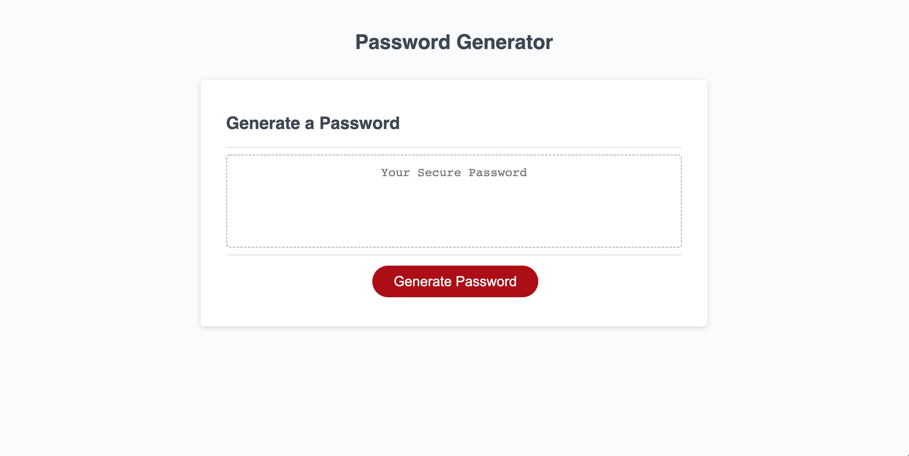
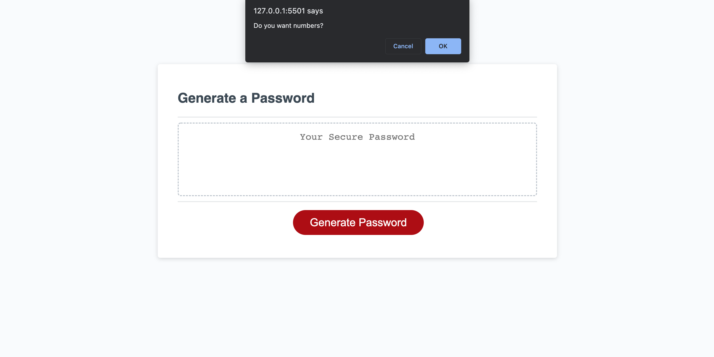
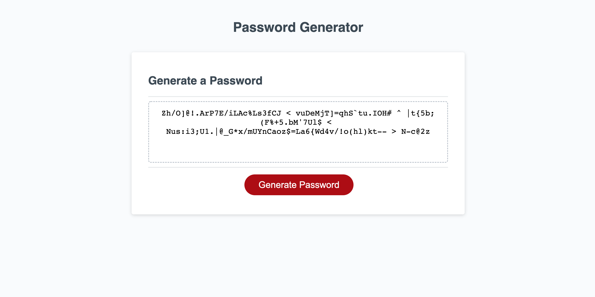

# <Password-Generator>

## Description

Using starter html and css, I added a javascript file that after clicking the genrate button would randomly genrate a password after setting parameters using prompts and confirms. Through this assignment I learned a lot about using javascript to make a functioning app. I also learned how to write a complex function that can take several different parameters and to be able to write the result of a function to the actual html.

## Installation

## Usage

After clicking the red button, you must enter a value between 8 and 128, then confirm at least one of the options to generate a password. If none are chosen or a correct number isn't put in the first prompt, a password won't generate.

    
    
    

## Credits

html and css were a part of the starter code give.
